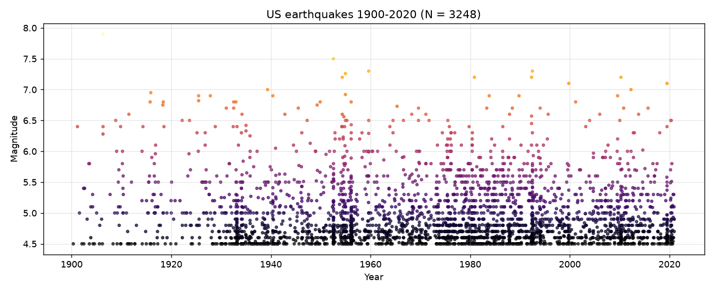
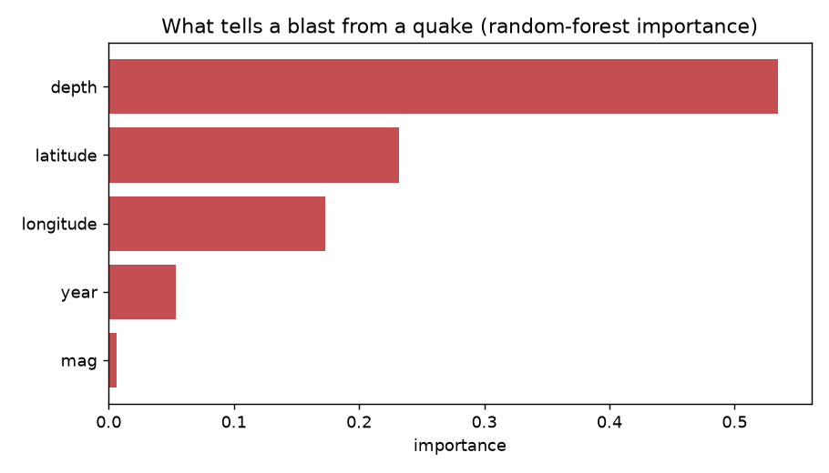

# GUIEP — Earthquake Seismicity Analysis

Quantitative analysis of US seismicity from a **USGS earthquake catalogue
(1900–2020, 3,248 events)**. The project computes the **seismicity index S**
(Gu Jicheng) — a single number that summarises the activity level of a region
and time window — together with a spatial-temporal index (ST4) and a
magnitude–time view of the catalogue.



## Seismicity index S

For the events in a chosen time window (count `N`, magnitudes `M_i`, largest
`M_max`):

```
S = 1.17 · log10(N + 1)
  + 0.29 · log10( (1/N) · Σ_i 10^(1.5·M_i) )
  + 0.15 · M_max
```

`S` ranges from roughly 0 to 10. The three terms capture, respectively, how
*many* events occurred, the *energy* released (the `10^(1.5M)` term is
proportional to seismic energy), and the *severity* of the single largest event.

## Usage

```bash
pip install -r requirements.txt

# whole catalogue (+ save the magnitude–time plot)
python src/seismicity.py --plot

# a specific window
python src/seismicity.py --start 1989-01-01 --end 1989-12-31
```

Example output:

```
Window         : 1900-04-30 -> 2020-12-14
Event count N  : 3248
M_max          : 7.90
Seismicity S   : 7.8751
Spatial ST4    : 0.3750
```

Spot checks against known events: the 1906-01..04 window captures the
**M7.9 San Francisco earthquake** (Apr 18 1906); the 1989 window captures the
**M6.9 Loma Prieta** sequence.

## SQL exploratory data analysis

The same catalogue is also loaded into a real **SQLite** database (Python's
built-in `sqlite3`, no external engine) and explored entirely with SQL. This
mirrors a typical *"collect data via SQL queries and perform exploratory data
analysis"* workflow.

```bash
python src/sql_analysis.py            # build DB in memory + run every query
python src/sql_analysis.py --db quakes.db   # also persist the .db file
```

What it does:

1. **Build the database** — `CREATE TABLE earthquakes` and bulk-`INSERT` all
   3,248 events, deriving `year`, `decade`, and a `region` label from the raw
   `place` text.
2. **A second `regions` lookup table** — the raw data records the same place
   inconsistently (`California` vs `CA`, `Mexico` vs `MX`); the lookup maps each
   raw token to a clean region name and a country, so a **`JOIN`** can group by a
   consistent label instead of double-counting.

The queries cover the core of SQL:

| Query | SQL features |
|-------|--------------|
| Strongest events (M ≥ 7) | `SELECT` / `WHERE` / `ORDER BY` / `LIMIT` |
| Activity per decade | `GROUP BY` + `COUNT` / `AVG` / `MAX` |
| Top regions (normalised) | `JOIN` + `GROUP BY` |
| Roll-up by country | `JOIN` + `GROUP BY` |
| Strongest quake each decade | window function `RANK() OVER (PARTITION BY …)` |

Every SQL aggregate is **cross-checked against an independent pandas
computation** (total count, max/mean magnitude, per-decade counts) and the run
prints `ALL CHECKS PASSED`, so the results are demonstrably correct.

Example output:

```
Q2  Activity per decade (GROUP BY + COUNT/AVG/MAX)
 decade  n_events  avg_mag  max_mag
   1900        41     5.22     7.90
   1950       433     4.98     7.50
   1980       551     4.93     7.20
   ...

Cross-validation (SQL  vs  pandas)
  [OK ] total event count            3248 == 3248
  [OK ] max magnitude                7.9 == 7.9
  [OK ] mean magnitude (4 dp)        4.9639 == 4.9639
ALL CHECKS PASSED
```

## Machine learning: earthquake vs man-made explosion

An end-to-end **scikit-learn** pipeline that ties the whole stack together —
*collect data via SQL → exploratory analysis → train and evaluate a model*.

```bash
python src/ml_model.py
```

**The problem.** This is the classic seismic *discrimination* task used in
nuclear-test monitoring (CTBT verification): given an event's location, depth,
time and magnitude, is it a natural earthquake or a man-made explosion? In this
catalogue the 248 man-made events are almost all Nevada Test Site nuclear tests
— very shallow (median depth **0 km** vs **7.2 km** for quakes), clustered in
Nevada, and confined to 1962–1999 — so the signal is real and interpretable.

**The pipeline.**

1. **Collect data via SQL** — the feature matrix and the label are pulled out of
   the SQLite database with a `SELECT ... CASE WHEN type = 'earthquake' ...`
   query (same DB as `sql_analysis.py`).
2. **EDA** — confirm the classes separate (depth is the giveaway).
3. **Model** — `SimpleImputer` (depth is ~18% missing) + classifier, in a proper
   `train_test_split` with **5-fold stratified cross-validation**. Because the
   target is imbalanced (7.6% positive), it uses `class_weight="balanced"` and
   reports **precision / recall / F1 / ROC-AUC**, not just accuracy.

**Results** (25% hold-out test set):

| Model | Test ROC-AUC | Man-made recall |
|-------|:------------:|:---------------:|
| Baseline (most-frequent) | 0.500 | 0.00 |
| Logistic regression | 0.969 | 0.94 |
| **Random forest** | **0.999** | **0.97** |

The baseline at 0.500 shows the task is non-trivial; the random forest catches
60 of 62 man-made events in the test set. Feature importances confirm the
physics — **depth** dominates, followed by location (Nevada) and era:



## Layout

```
src/seismicity.py          analysis library + CLI (load, S index, ST4, plot)
src/sql_analysis.py        SQLite-based SQL EDA + pandas cross-validation
src/ml_model.py            scikit-learn classifier (SQL features -> model)
data/usgs_earthquakes_1900_2020.csv   USGS catalogue (3,248 events)
results/magnitude_time.png            generated figure (magnitude vs time)
results/feature_importance.png        generated figure (model feature weights)
seismicity ST3 ST4.py      original exploratory script (kept for reference)
```

## Data

The catalogue is the USGS earthquake search export
(<https://earthquake.usgs.gov/earthquakes/>). The loader accepts both the
standard `...T...Z` timestamp format and the hyphenated variant stored here.

## Notes

The analysis is packaged as a reusable module with a command-line interface,
robust date parsing for the USGS catalogue formats, and a magnitude–time
visualization.
